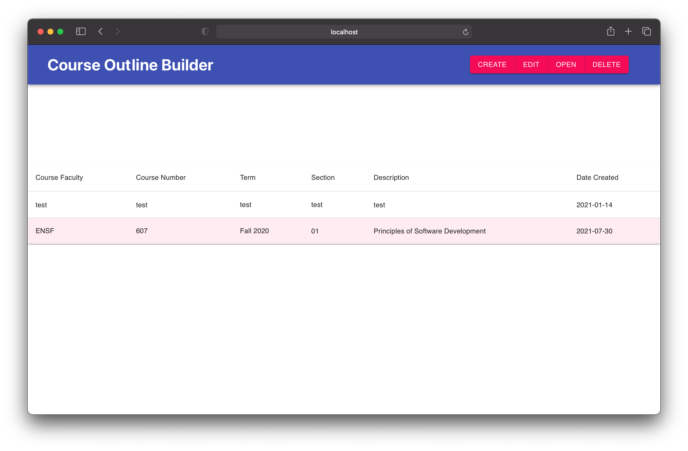
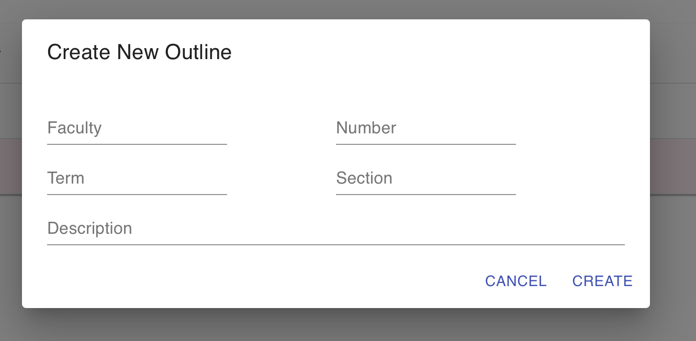
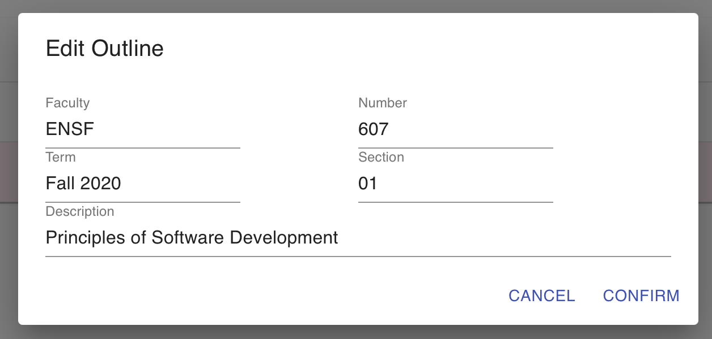
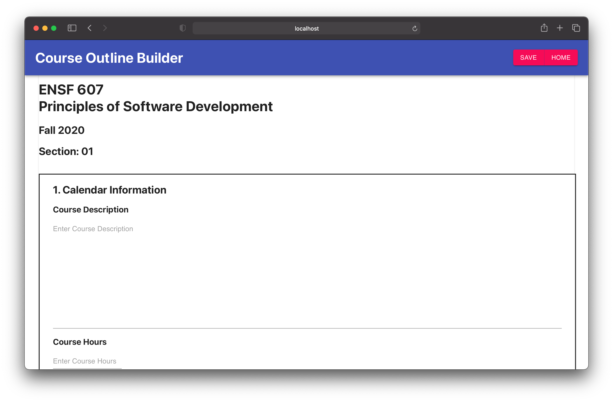
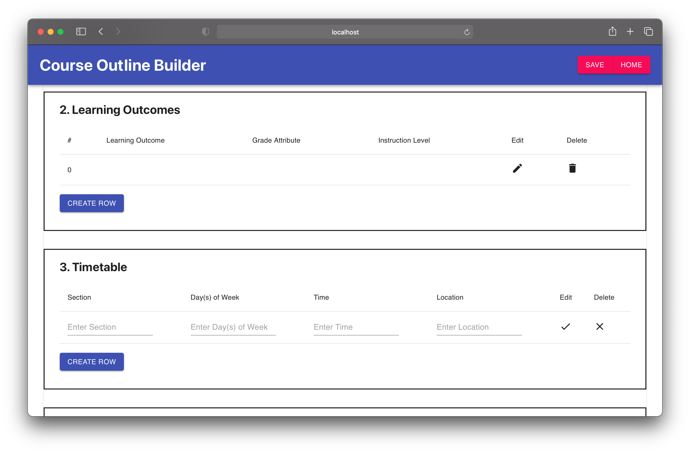
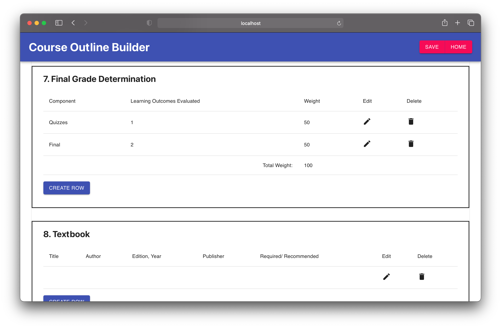

# ENSF-607-Web-Development-Project

## Authors
- Evan Boerchers
- Dean Kim
- Hunter Kimmett

## Introduction

The goal of this project was to create a web application using React for the frontend and Django for the backend. This web app would serve as a form for teachers to input information for their classes to be easily exported into a format useable by the University. The project also served as a way to demonstrate an Agile workflow, and our group kept Scrum notes pertaining to this facet of the project.

This project includes the course outline builder app itself as well as two preprojects: one for the backend demonstrating Django usage, and one for the frontend creating a simple React web app.

## Contents

The following folders are included in this project:

### CourseOutlineBuilder

Course Outline Builder web app project folder, containing the following packages for the backend and frontend:

- outline_backend
- outline_frontend

### PreProjects

Aforementioned preprojects, demonstrating Django and React usage:

- Django_Evan
- React_Preproject

### screenshots

Screenshots demonstrating the web app for this README.

### Scrum

Scrum notes for each of the 3 sprints done and their respective milestones completed under this project.

- Sprint 1 - Pre Project
- Sprint 2 -  Milestone 1
- Sprint 3 - Milestone 2

## Dependencies

The following packages are required to run this project:

#### frontend
- React Native
- npm
- node
- material-ui/core
- maerial-ui/icons
- axios
- react-router

#### backend
- django
- djagno rest_framework
- django-filter
- django-cors-headers

## Running

### backend
- Ensure the required dependencies are located in the enviroment in which the django server will be running.
- Navigate to CourseOutlineBuilder/outline_backend folder. 
- Enter command `python manage.py runserver`

### frontend
- Ensure node and npm/yarn is installed on machine.
- Navigate to CourseOutlineBuilder/outline_frontend folder. 
- Run `npm install` to install needed packages.
- Run `npm start` to start the local server.

## App Demo

Once backend and frontend are running, the following home page should open:

From this home page, one can create a new course, edit the base information of an existing one, open the full outline for editing, or delete a course. Using 'Create' will bring up the following prompt:

Using 'Edit' will bring up a similar prompt:

Using 'Delete' will simply delete the selected outline. Using 'Open' will open a new page with the selected outline's full outline on display, which can be edited.

Using 'Save' will save any changes into the backend (and the SQL database), while 'Home' will return to the home page. 

The outline contains 9 sections with varying fields, some of which are simple text fields, others being dynamic tables containing their own fields. These dynamic tables can be edited and have rows added/deleted. Below is an example of one:

The 'Final Grade Determination' table is a notable one, as this table contains a row which will sum all the other rows so that the user can ensure their grades add up to 100%.

